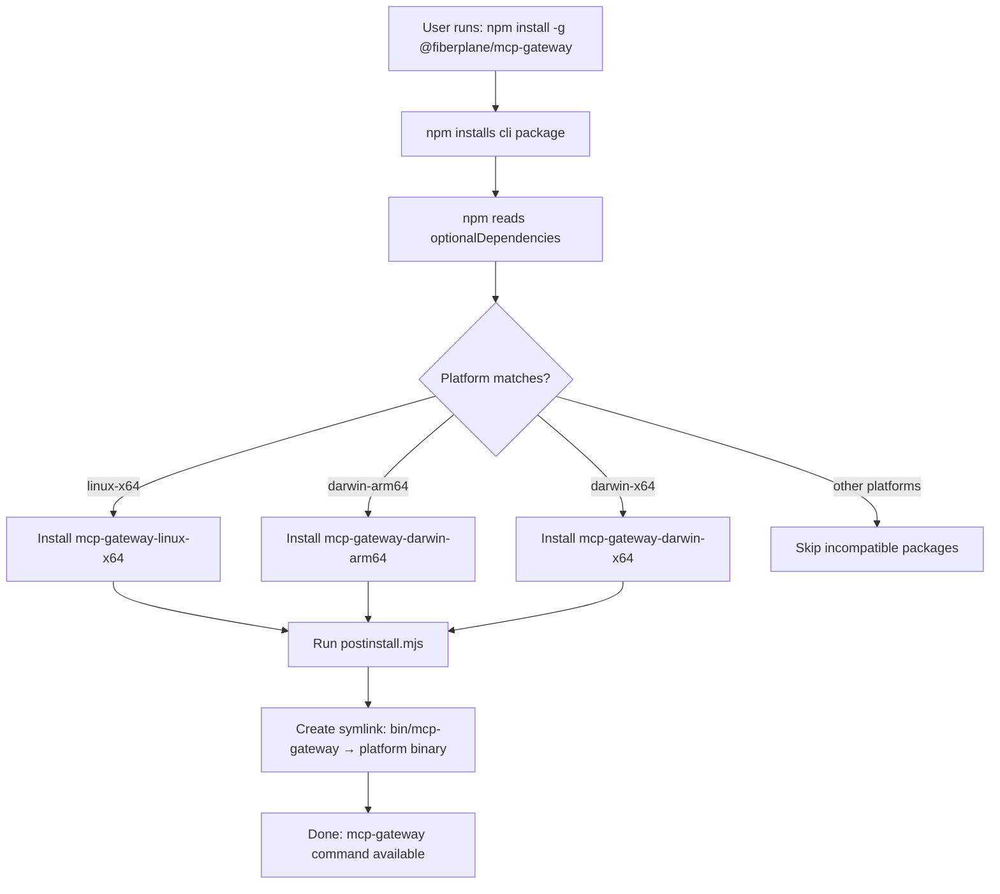

# Binary Distribution Strategy for MCP Gateway

## Overview

This document outlines the strategy for distributing `@fiberplane/mcp-gateway` as compiled Bun binaries through npm, following the pattern used by [opencode](https://github.com/sst/opencode) and [other binary-distributed packages](https://sentry.engineering/blog/publishing-binaries-on-npm).

## Problem Statement

The current build bundles `@opentui/core` which uses Bun-specific APIs (`bun:ffi`), making the package incompatible with Node.js when installed via `npm install -g @fiberplane/mcp-gateway`.

## Solution: Platform-Specific Binary Distribution

Compile the application into standalone Bun binaries for each platform and distribute them as optional dependencies.

## Architecture

### 1. Package Structure

```
packages/
├── mcp-gateway/                    # Source code (unchanged)
│   ├── src/
│   ├── package.json
│   └── scripts/build.ts
│
├── mcp-gateway-linux-x64/          # Platform binaries (NEW)
│   ├── mcp-gateway                 # Compiled binary
│   └── package.json                # os: ["linux"], cpu: ["x64"]
│
├── mcp-gateway-darwin-arm64/       # Platform binaries (NEW)
│   ├── mcp-gateway                 # Compiled binary
│   └── package.json                # os: ["darwin"], cpu: ["arm64"]
│
├── mcp-gateway-darwin-x64/         # Platform binaries (NEW)
│   ├── mcp-gateway                 # Compiled binary
│   └── package.json                # os: ["darwin"], cpu: ["x64"]
│
└── cli/                            # Wrapper package (NEW)
    ├── package.json                # Main package with optionalDependencies
    ├── postinstall.mjs             # Binary selection and symlink creation
    └── bin/
        └── mcp-gateway             # Symlink to platform binary
```

**Note**: Start with 3 core platforms (linux-x64, darwin-arm64, darwin-x64). Windows and ARM Linux can be added later.

### 2. How It Works

#### Installation Flow



#### Key Mechanisms

1. **optionalDependencies**: npm installs only packages matching the current platform's `os` and `cpu` fields
2. **postinstall script**: Detects platform, finds the installed binary, creates a symlink
3. **bin field**: Points to the symlink, making the command globally available

## Implementation

### Step 1: Build Script

**File**: `scripts/build-binaries.ts`

```typescript
#!/usr/bin/env bun
import { $ } from "bun";
import { mkdir } from "fs/promises";
import { join } from "path";

// Read version from main package
const mainPkg = await Bun.file("./packages/mcp-gateway/package.json").json();
const VERSION = mainPkg.version;

const PLATFORMS = [
  { target: "bun-linux-x64", name: "linux-x64", os: "linux", cpu: "x64", ext: "" },
  { target: "bun-darwin-arm64", name: "darwin-arm64", os: "darwin", cpu: "arm64", ext: "" },
  { target: "bun-darwin-x64", name: "darwin-x64", os: "darwin", cpu: "x64", ext: "" },
];

console.log(`Building binaries v${VERSION} for ${PLATFORMS.length} platforms...\n`);

for (const platform of PLATFORMS) {
  console.log(`📦 Building for ${platform.name}...`);

  const pkgDir = `./packages/mcp-gateway-${platform.name}`;
  await mkdir(pkgDir, { recursive: true });

  // Compile binary
  await $`bun build --compile \
    --target=${platform.target} \
    --minify \
    --bytecode \
    ./packages/mcp-gateway/src/run-v2.ts \
    --outfile ${pkgDir}/mcp-gateway${platform.ext}`;

  // Make executable
  if (platform.ext === "") {
    await $`chmod +x ${pkgDir}/mcp-gateway`;
  }

  // Create package.json
  const pkgJson = {
    name: `@fiberplane/mcp-gateway-${platform.name}`,
    version: VERSION,
    description: `MCP Gateway binary for ${platform.os}-${platform.cpu}`,
    os: [platform.os],
    cpu: [platform.cpu],
    files: [`mcp-gateway${platform.ext}`],
    publishConfig: {
      access: "public"
    }
  };

  await Bun.write(
    join(pkgDir, "package.json"),
    JSON.stringify(pkgJson, null, 2)
  );

  console.log(`✓ Built ${platform.name}\n`);
}

console.log("✅ All binaries built successfully!");
```

**Usage**: `bun run scripts/build-binaries.ts`

### Step 2: Wrapper Package

**File**: `packages/cli/package.json`

```json
{
  "name": "@fiberplane/mcp-gateway",
  "version": "0.4.1",
  "description": "Local HTTP proxy for managing and debugging Model Context Protocol servers",
  "type": "module",
  "bin": {
    "mcp-gateway": "./bin/mcp-gateway"
  },
  "scripts": {
    "postinstall": "node postinstall.mjs"
  },
  "optionalDependencies": {
    "@fiberplane/mcp-gateway-linux-x64": "0.4.1",
    "@fiberplane/mcp-gateway-darwin-arm64": "0.4.1",
    "@fiberplane/mcp-gateway-darwin-x64": "0.4.1"
  },
  "publishConfig": {
    "access": "public"
  },
  "homepage": "https://github.com/fiberplane/mcp-gateway",
  "repository": {
    "type": "git",
    "url": "git+https://github.com/fiberplane/mcp-gateway.git"
  },
  "keywords": ["mcp", "model-context-protocol", "proxy", "gateway"],
  "license": "MIT"
}
```

### Step 3: PostInstall Script

**File**: `packages/cli/postinstall.mjs`

```javascript
#!/usr/bin/env node
import { existsSync, mkdirSync, symlinkSync, chmodSync, copyFileSync, unlinkSync } from "fs";
import { dirname, join } from "path";
import { fileURLToPath } from "url";

const __dirname = dirname(fileURLToPath(import.meta.url));

// Platform detection
const PLATFORM_MAP = {
  "linux-x64": "linux-x64",
  "linux-arm64": "linux-arm64", // Future support
  "darwin-x64": "darwin-x64",
  "darwin-arm64": "darwin-arm64",
  "win32-x64": "win32-x64", // Future support
};

const platform = `${process.platform}-${process.arch}`;
const platformKey = PLATFORM_MAP[platform];

if (!platformKey) {
  console.error(`❌ Unsupported platform: ${platform}`);
  console.error(`   Supported platforms: ${Object.keys(PLATFORM_MAP).join(", ")}`);
  process.exit(1);
}

// Find binary
const ext = process.platform === "win32" ? ".exe" : "";
const binaryName = `mcp-gateway${ext}`;
const pkgName = `@fiberplane/mcp-gateway-${platformKey}`;
const binaryPath = join(__dirname, "node_modules", pkgName, binaryName);

if (!existsSync(binaryPath)) {
  console.error(`❌ Could not find binary for ${platform}`);
  console.error(`   Expected at: ${binaryPath}`);
  console.error(`   Package ${pkgName} may not have been installed.`);
  process.exit(1);
}

// Create bin directory
const binDir = join(__dirname, "bin");
mkdirSync(binDir, { recursive: true });

const binPath = join(binDir, "mcp-gateway");

// Remove existing symlink/file
if (existsSync(binPath)) {
  unlinkSync(binPath);
}

// Create symlink (or copy on Windows)
try {
  if (process.platform === "win32") {
    // Windows: copy instead of symlink (requires fewer permissions)
    copyFileSync(binaryPath, binPath);
    console.log(`✓ Copied mcp-gateway binary for ${platform}`);
  } else {
    // Unix: symlink (more efficient)
    symlinkSync(binaryPath, binPath);
    chmodSync(binPath, 0o755);
    console.log(`✓ Installed mcp-gateway binary for ${platform}`);
  }
} catch (error) {
  console.error(`❌ Failed to create binary symlink: ${error.message}`);
  process.exit(1);
}
```

### Step 4: Update Workspace Configuration

**File**: `package.json` (root)

Add the new packages to the workspace:

```json
{
  "workspaces": [
    "packages/*",
    "test-mcp-server"
  ]
}
```

The `packages/*` glob will automatically include all platform packages and the cli package.

### Step 5: CI/CD Pipeline

**File**: `.github/workflows/release.yml`

```yaml
name: Release Binaries

on:
  push:
    branches:
      - main
    paths:
      - 'packages/mcp-gateway/**'
      - '.changeset/**'
  workflow_dispatch:

jobs:
  build-and-publish:
    runs-on: ubuntu-latest
    permissions:
      contents: write
      id-token: write

    steps:
      - name: Checkout
        uses: actions/checkout@v4
        with:
          fetch-depth: 0

      - name: Setup Bun
        uses: oven-sh/setup-bun@v2
        with:
          bun-version: latest

      - name: Setup Node.js
        uses: actions/setup-node@v4
        with:
          node-version: 22
          registry-url: 'https://registry.npmjs.org'

      - name: Install dependencies
        run: bun install --frozen-lockfile

      - name: Build binaries
        run: bun run scripts/build-binaries.ts

      - name: Version packages
        run: |
          bun changeset version
          git add .
          git commit -m "chore: version packages" || true

      - name: Publish platform binaries
        run: |
          for dir in packages/mcp-gateway-*/; do
            if [ -f "$dir/package.json" ]; then
              echo "Publishing $(basename $dir)..."
              cd "$dir"
              npm publish --access public
              cd ../..
            fi
          done
        env:
          NODE_AUTH_TOKEN: ${{ secrets.NPM_TOKEN }}

      - name: Publish CLI wrapper
        run: |
          cd packages/cli
          npm publish --access public
        env:
          NODE_AUTH_TOKEN: ${{ secrets.NPM_TOKEN }}

      - name: Create GitHub Release
        uses: changesets/action@v1
        with:
          publish: echo "Already published to npm"
        env:
          GITHUB_TOKEN: ${{ secrets.GITHUB_TOKEN }}
```

## Benefits

### For Users

1. ✅ **Works with npm/npx**: `npx @fiberplane/mcp-gateway` just works
2. ✅ **No runtime required**: Users don't need Bun or Node.js installed
3. ✅ **Fast startup**: No transpilation or import resolution at runtime
4. ✅ **Small download**: Only downloads binary for their platform (~100MB vs ~600MB for all)
5. ✅ **TUI works perfectly**: All Bun-specific dependencies bundled

### For Development

1. ✅ **Cross-platform builds**: Build all platforms from Linux CI
2. ✅ **Simple release**: One script builds everything
3. ✅ **Version sync**: All packages share the same version
4. ✅ **Monorepo friendly**: Fits naturally into existing workspace structure

## Trade-offs

- ⚠️ **Binary size**: ~90-100MB per platform (includes Bun runtime)
- ⚠️ **Build time**: ~2-3 minutes to compile all platforms
- ⚠️ **Multiple packages**: Must publish 4 packages per release (3 platforms + wrapper)
- ⚠️ **Requires Bun**: Development/CI needs Bun installed (not end users)

## Rollout Plan

### Phase 1: Initial Implementation (Current PR)
- [x] Fix immediate Node.js compatibility (externalize @opentui - temporary)
- [ ] Create binary build infrastructure
- [ ] Test locally on all 3 platforms
- [ ] Update documentation

### Phase 2: Beta Testing
- [ ] Publish as `@fiberplane/mcp-gateway@next`
- [ ] Test with real users
- [ ] Verify installation on all platforms
- [ ] Monitor for edge cases

### Phase 3: Production Release
- [ ] Promote to latest
- [ ] Update README with new installation instructions
- [ ] Add platform support badges
- [ ] Monitor npm download stats per platform

### Phase 4: Expansion (Future)
- [ ] Add Windows support (win32-x64)
- [ ] Add ARM Linux support (linux-arm64)
- [ ] Consider Alpine/musl Linux variant
- [ ] Optimize binary size if needed

## Testing

### Local Testing

```bash
# Build all binaries
bun run scripts/build-binaries.ts

# Test each platform package locally
cd packages/mcp-gateway-linux-x64
./mcp-gateway --version

# Test wrapper package locally (use npm link)
cd ../cli
npm link
mcp-gateway --help
```

### CI Testing

Each platform binary should be tested in CI before publishing:

```yaml
test-binaries:
  strategy:
    matrix:
      os: [ubuntu-latest, macos-13, macos-14]
  runs-on: ${{ matrix.os }}
  steps:
    - name: Test binary
      run: |
        ./packages/mcp-gateway-*/mcp-gateway --version
        ./packages/mcp-gateway-*/mcp-gateway --help
```

## Alternative Approaches Considered

### 1. Node.js Compatibility Layer
**Rejected**: Would require implementing polyfills for `bun:ffi` and tree-sitter, adding significant complexity.

### 2. Pure Node.js Rewrite
**Rejected**: Would lose OpenTUI's powerful terminal rendering capabilities and require finding Node.js alternatives.

### 3. Require Bun Runtime
**Rejected**: Adds friction for users who just want `npx mcp-gateway` to work.

### 4. WebAssembly Build
**Rejected**: tree-sitter WASM exists, but OpenTUI expects native bindings. Would be a major rewrite.

## Resources

- [Bun Build Documentation](https://bun.sh/docs/bundler/executables)
- [Publishing Binaries on npm (Sentry)](https://sentry.engineering/blog/publishing-binaries-on-npm)
- [OpenCode Repository](https://github.com/sst/opencode)
- [npm optionalDependencies](https://docs.npmjs.com/cli/v10/configuring-npm/package-json#optionaldependencies)

## Questions & Answers

**Q: Why not use `pkg` or `nexe`?**
A: These tools are Node.js-specific and don't support Bun's runtime features. Since we're using Bun-specific APIs, we need Bun's compiler.

**Q: Can users still run from source?**
A: Yes! Developers can still clone the repo and run `bun run dev`. The binary distribution is for end users who want `npx` to work.

**Q: What about auto-updates?**
A: Users can update with `npm install -g @fiberplane/mcp-gateway@latest`. Future: consider adding a `--check-updates` flag.

**Q: How do we handle breaking changes in Bun?**
A: Pin the Bun version used for compilation in CI. Test new Bun versions before updating the build target.

---

**Status**: 📝 Planning
**Next Step**: Implement Phase 1 (build infrastructure)
**Owner**: Development Team
**Last Updated**: 2025-10-14
