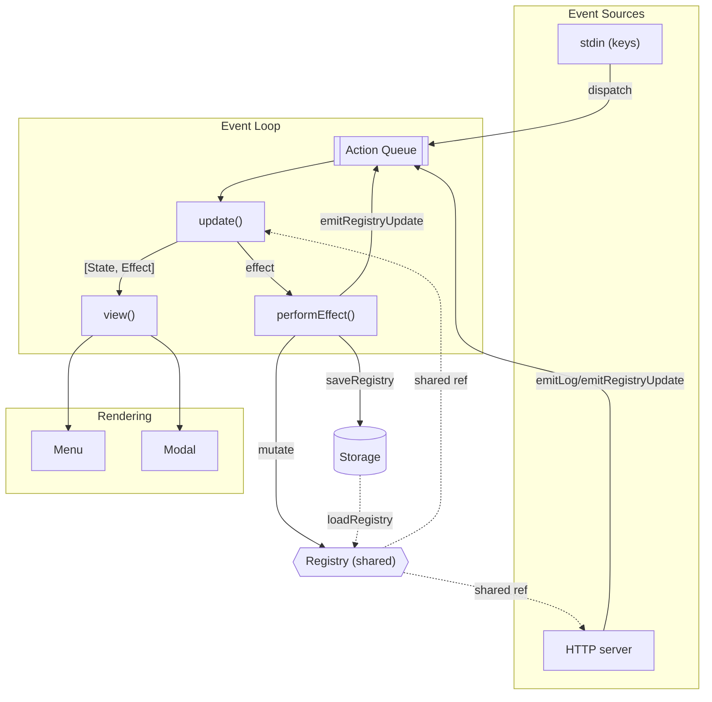

# Terminal UI Overview

The MCP Gateway CLI ships with a Phoenix-inspired terminal UI in `packages/mcp-gateway/src/tui`. Much like a LiveView process, it listens for events, runs them through a reducer that updates assigns (state), triggers side-effects, and re-renders the view on every cycle. A single event bus keeps the TUI and HTTP server in sync, echoing Phoenix's pub/sub model.

## Architecture at a Glance

## Boot Sequence (`packages/mcp-gateway/src/run.ts`)
1. CLI arguments are parsed and the on-disk registry is loaded.
2. `createApp` spins up the HTTP proxy in `server.ts` and hands back the shared `registry` object.
3. `runTUI(context, registry)` launches the interactive loop. The `Context` carries the storage root plus an `onExit` hook so quitting the TUI also shuts down the HTTP server.

## Event Loop (`packages/mcp-gateway/src/tui/loop.ts`)
- `runTUI` sets the initial assigns `{ registry, running: true, mode: "menu", logs: [] }`, enables raw stdin, renders once, and subscribes to the `tuiEvents` bus.
- Raw key presses become Phoenix-style events (`key_pressed`, `quit`, etc.) that land on the action queue. Ctrl+C becomes an explicit `quit` event; keys like `a`, `d`, and `q` map to menu actions.
- The `update` reducer mimics a `handle_event` callback: it derives the next state and returns a declarative `Effect` (for example `{ type: "add_server" }`).
- Each processed action executes in the order: reduce → render → perform effect → render again. When `running` flips to `false`, the loop tears down stdin listeners, invokes `context.onExit`, and exits cleanly.

## State, Actions, and Effects
- `state.ts` defines the LiveView-style assigns (`State`), available modes, and log entry shape alongside the runtime `Context`.
- `events.ts` exposes a shared `EventEmitter` that acts like Phoenix pub/sub. Server-side modules emit `registry_updated` and `log_added` events through this channel.
- `effects.ts` interprets the reducer's declarative effects and delegates to prompt handlers for any side-effects.

## Rendering (`packages/mcp-gateway/src/tui/view.ts` & `components`)
- `view.ts` only renders while in `mode === "menu"`, the equivalent of LiveView's diff push; prompts temporarily pause redraws to keep user input intact.
- `components/menu.ts` clears the screen, prints gateway stats, lists configured servers, and shows the "Recent Activity" feed sourced from proxy events. It calls `getActiveSessions()` from `capture.ts` to surface open SSE streams.
- `components/formatting.ts` centralises ANSI colour codes and formatting helpers for URLs and timestamps.

## Prompts and Mutation (`components/prompts.ts`)
- Prompts reuse stdin and dispatch `prompt_started`/`prompt_ended`, which toggles the UI into a dedicated input mode—akin to pushing a modal assign in LiveView.
- Input handling honours Escape (cancel), Enter (submit), Backspace, and Ctrl+C (exit).
- `handleAddServer` and `handleDeleteServer` mutate the shared registry in place, persist via `saveRegistry`, and emit success or error feedback before handing control back to the menu loop.

## Server Integration (`packages/mcp-gateway/src/server.ts`)
- The HTTP proxy operates on the same registry reference the TUI uses, so prompt-driven mutations immediately affect routed traffic.
- After each request the proxy builds a `LogEntry` and calls `emitLog`, delivering a `log_added` action that the TUI picks up like a LiveView message.
- Whenever the proxy updates metadata such as `lastActivity` or `exchangeCount`, it triggers `emitRegistryUpdate`, prompting a re-render with fresh stats.
- SSE capture work runs asynchronously yet still pushes meaningful events into the loop, keeping the "Recent Activity" feed current without blocking the UI.

## Lifecycle Summary
1. CLI boots the proxy and the TUI, sharing the registry and storage context.
2. User and server messages funnel through the event bus, powering the reducer/effect loop.
3. Prompts mutate the registry and persist changes; proxy traffic feeds telemetry back into the loop.
4. The menu keeps a live view of the system until the user quits, at which point the TUI invokes `context.onExit` and the CLI exits gracefully.

The result is a lightweight, Phoenix-inspired control plane where a single event loop coordinates user input, server telemetry, and persistent state without the two halves needing to know about each other's inner workings.
